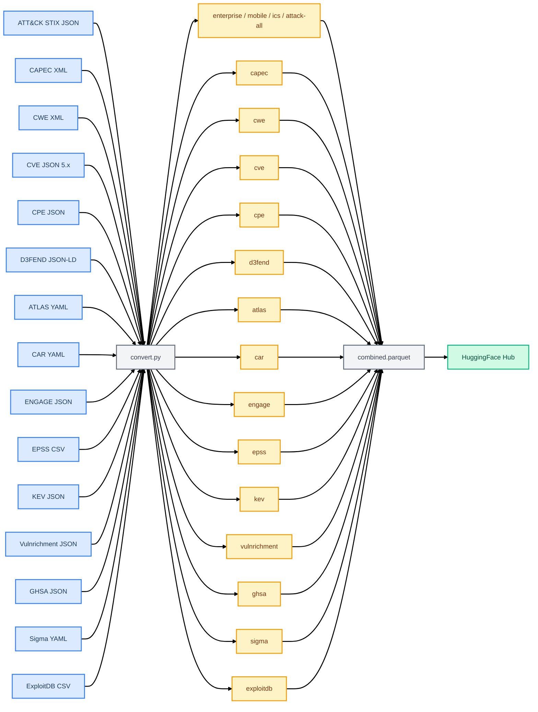
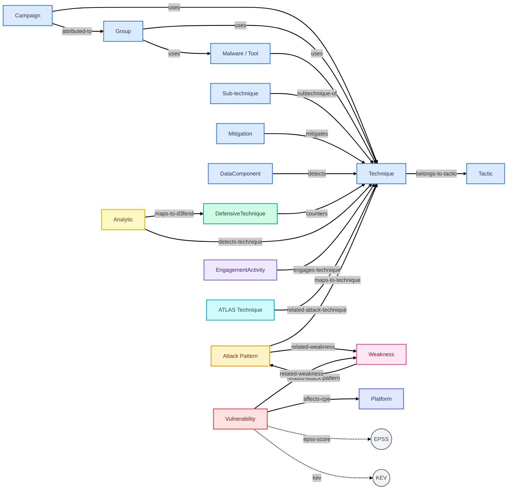

# security-kg

[](https://github.com/S0UGATA/security-kg/actions/workflows/ci.yml)
[](https://github.com/S0UGATA/security-kg/actions/workflows/update-dataset.yml)
[](https://huggingface.co/datasets/s0u9ata/security-kg)
[](https://www.python.org/downloads/)
[](LICENSE)

Convert security data from 15 sources into **Subject-Predicate-Object (SPO) knowledge-graph triples** in Parquet format.

Sources: [ATT&CK](https://attack.mitre.org/) · [CAPEC](https://capec.mitre.org/) · [CWE](https://cwe.mitre.org/) · [CVE](https://www.cve.org/) · [CPE](https://nvd.nist.gov/products/cpe) · [D3FEND](https://d3fend.mitre.org/) · [ATLAS](https://atlas.mitre.org/) · [CAR](https://car.mitre.org/) · [ENGAGE](https://engage.mitre.org/) · [EPSS](https://www.first.org/epss/) · [KEV](https://www.cisa.gov/known-exploited-vulnerabilities-catalog) · [Vulnrichment](https://github.com/cisagov/vulnrichment) · [GHSA](https://github.com/github/advisory-database) · [Sigma](https://github.com/SigmaHQ/sigma) · [ExploitDB](https://gitlab.com/exploit-database/exploitdb)

## Data Flow



## Knowledge Graph Structure



> Legend: <span style="color:#3b82f6">**Blue** = ATT&CK</span> · <span style="color:#f59e0b">**Amber** = CAPEC</span> · <span style="color:#ec4899">**Pink** = CWE</span> · <span style="color:#ef4444">**Red** = CVE</span> · <span style="color:#6366f1">**Indigo** = CPE</span> · <span style="color:#10b981">**Green** = D3FEND</span> · <span style="color:#06b6d4">**Cyan** = ATLAS</span> · <span style="color:#eab308">**Yellow** = CAR</span> · <span style="color:#8b5cf6">**Violet** = ENGAGE</span>

## Usage

```bash
# Install dependencies
pip install -r requirements.txt

# Convert everything (all 15 sources) and produce combined.parquet
python src/convert.py

# Convert only ATT&CK
python src/convert.py --sources attack

# Convert a single ATT&CK domain
python src/convert.py --sources attack --domains enterprise

# Convert only CAPEC and CWE (skip others)
python src/convert.py --sources capec cwe

# Convert CVE, EPSS, and KEV together
python src/convert.py --sources cve epss kev

# Skip combined.parquet generation
python src/convert.py --no-combined

# Run individual converters standalone
python src/convert_attack.py
python src/convert_capec.py
python src/convert_cve.py
python src/convert_kev.py

# Use Parquet v1 format for backward compatibility (default is v2)
python src/convert.py --parquet-format v1
```

Source files are cached in `source/` by default. Files are versioned using `Last-Modified` or `ETag` headers and only re-downloaded when the source has been updated. Sources that don't provide version headers are always re-downloaded.

Output goes to `output/`:

| File | Source | Est. Triples |
|------|--------|-------------|
| `enterprise.parquet` | ATT&CK Enterprise | ~42K |
| `mobile.parquet` | ATT&CK Mobile | ~5K |
| `ics.parquet` | ATT&CK ICS | ~4K |
| `attack-all.parquet` | ATT&CK combined (deduplicated) | ~50K |
| `capec.parquet` | CAPEC attack patterns | ~8K |
| `cwe.parquet` | CWE weaknesses | ~15K |
| `cve.parquet` | CVE vulnerabilities | ~1.5-3M |
| `cpe.parquet` | CPE platform enumeration | ~2-4M |
| `d3fend.parquet` | D3FEND defensive techniques | ~3K |
| `atlas.parquet` | ATLAS AI/ML techniques | ~3K |
| `car.parquet` | CAR analytics | ~2K |
| `engage.parquet` | ENGAGE adversary engagement | ~2K |
| `epss.parquet` | EPSS exploit prediction scores | ~650K |
| `kev.parquet` | KEV known exploited vulns | ~9K |
| `vulnrichment.parquet` | CISA Vulnrichment (SSVC, CVSS, CWE) | ~200-400K |
| `ghsa.parquet` | GitHub Security Advisories | ~20-40K |
| `sigma.parquet` | Sigma detection rules | ~20-40K |
| `exploitdb.parquet` | ExploitDB public exploits | ~300-500K |
| `combined.parquet` | All sources merged (deduplicated) | ~5-10M |

## Cross-Source Links

```
ATT&CK <──> CAPEC <──> CWE <──> CVE <──> CPE
  ^                              ^
  ├── D3FEND (counters)          ├── EPSS (scores)
  ├── ATLAS (AI parallel)        ├── KEV (exploited)
  ├── CAR (detects)              ├── Vulnrichment (SSVC/CVSS)
  ├── ENGAGE (engages)           ├── GHSA (advisories)
  └── Sigma (detects)            ├── Sigma (related CVE)
                                 └── ExploitDB (exploits)
```

## Tests

```bash
# Unit tests (no network access required)
python -m pytest tests/ -v --ignore=tests/test_integration.py

# Integration tests (downloads real ATT&CK data)
python -m pytest tests/test_integration.py -v

# All tests
python -m pytest tests/ -v
```

## HuggingFace Dataset

The dataset is published at [s0u9ata/security-kg](https://huggingface.co/datasets/s0u9ata/security-kg) on HuggingFace Hub and auto-updated weekly via GitHub Actions.

See the [dataset card](hf_dataset/README.md) for schema details, example queries, and usage with the `datasets` library.

## Future Data Sources

The following sources were researched and evaluated for inclusion. They are deferred for now but may be added in future versions.

### High-Value Deferred Sources

| Source | Format | Why Deferred |
|--------|--------|-------------|
| [MISP Galaxies](https://github.com/MISP/misp-galaxy) | JSON | Excellent structure with ATT&CK mappings; 100+ galaxy clusters covering threat actors, tools, sectors. Deferred to keep initial scope manageable. |
| [EUVD](https://euvd.enisa.europa.eu/) | JSON | EU vulnerability database, structured, CVE-linked. New (launched 2025), API still maturing. |
| [OSV](https://osv.dev/) | JSON | Google's open-source vulnerability DB with bulk download. Focused on software packages rather than CVE-level vulnerabilities. |

### International Sources Investigated

| Source | Country | Status |
|--------|---------|--------|
| [JVN iPedia](https://jvndb.jvn.jp/) | Japan | RSS feeds available, CVE-linked, bilingual (JP/EN). Limited bulk structured data access. |
| [ThaiCERT](https://apt.thaicert.or.th/) | Thailand | 504 APT group threat cards, structured. Niche coverage, limited API. |
| [CNNVD](http://www.cnnvd.org.cn/) / [CNVD](https://www.cnvd.org.cn/) | China | Access restrictions for non-Chinese IPs, data quality concerns, significant latency vs NVD. |
| [KrCERT](https://www.krcert.or.kr/) / KNVD | South Korea | Limited public API, Korean-language only. |
| [BSI](https://www.bsi.bund.de/) | Germany | Advisories available, German-language, no bulk structured feed. |
| [ANSSI](https://www.cert.ssi.gouv.fr/) | France | Advisories and IOC reports, French-language, limited machine-readable data. |
| [CERT-In](https://www.cert-in.org.in/) | India | CVE CNA, publishes advisories but no bulk structured data download. |
| [AusCERT](https://auscert.org.au/) | Australia | RSS feeds available, English-language. Limited structured data beyond advisories. |
| [CERT-EU](https://cert.europa.eu/) | EU | Threat landscape reports, limited machine-readable data. |
| [BDU (FSTEC)](https://bdu.fstec.ru/) | Russia | Poor data quality, slow updates, access restrictions. |

### Specialized / Niche Sources

| Source | Why Not Included |
|--------|-----------------|
| [MAEC](https://maecproject.github.io/) | Malware attribute enumeration. Sparse community adoption, limited structured data available. |
| [OVAL](https://oval.mitre.org/) | Compliance-focused XML definitions. Very large, focused on system configuration rather than threat context. |
| [CCE](https://ncp.nist.gov/cce) | Configuration enumeration (Excel format). Narrow scope, limited cross-linking potential. |

## License

Apache 2.0
