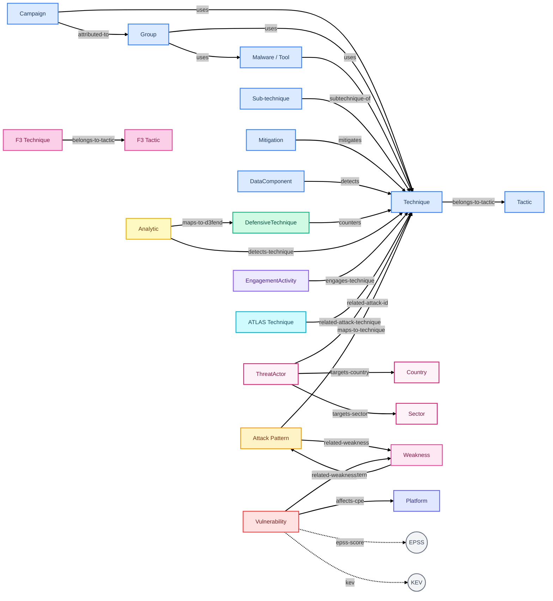

# security-kg

[](https://github.com/S0UGATA/security-kg/actions/workflows/ci.yml)
[](https://github.com/S0UGATA/security-kg/actions/workflows/update-dataset.yml)
[](https://huggingface.co/datasets/s0u9ata/security-kg)
[](https://www.python.org/downloads/)
[](LICENSE)
[](https://s0ugata.github.io/security-kg-viz/)

Convert security data from 17 sources into **Subject-Predicate-Object (SPO) knowledge-graph triples** in Parquet format.

Sources: [ATT&CK](https://attack.mitre.org/) · [CAPEC](https://capec.mitre.org/) · [CWE](https://cwe.mitre.org/) · [CVE](https://www.cve.org/) · [CPE](https://nvd.nist.gov/products/cpe) · [D3FEND](https://d3fend.mitre.org/) · [ATLAS](https://atlas.mitre.org/) · [CAR](https://car.mitre.org/) · [ENGAGE](https://engage.mitre.org/) · [F3](https://ctid.mitre.org/fraud) · [EPSS](https://www.first.org/epss/) · [KEV](https://www.cisa.gov/known-exploited-vulnerabilities-catalog) · [Vulnrichment](https://github.com/cisagov/vulnrichment) · [GHSA](https://github.com/github/advisory-database) · [Sigma](https://github.com/SigmaHQ/sigma) · [ExploitDB](https://gitlab.com/exploit-database/exploitdb) · [MISP Galaxies](https://github.com/MISP/misp-galaxy)

## Knowledge Graph Structure



> Legend: <span style="color:#3b82f6">**Blue** = ATT&CK</span> · <span style="color:#f59e0b">**Amber** = CAPEC</span> · <span style="color:#ec4899">**Pink** = CWE / F3</span> · <span style="color:#ef4444">**Red** = CVE</span> · <span style="color:#6366f1">**Indigo** = CPE</span> · <span style="color:#10b981">**Green** = D3FEND</span> · <span style="color:#06b6d4">**Cyan** = ATLAS</span> · <span style="color:#eab308">**Yellow** = CAR</span> · <span style="color:#8b5cf6">**Violet** = ENGAGE</span> · <span style="color:#db2777">**Fuchsia** = MISP Galaxies</span> · <span style="color:#6b7280">**Gray** = EPSS / KEV</span>

## Usage

```bash
pip install -r requirements.txt

# Convert all 17 sources → output/*.parquet + combined.parquet
python src/convert.py

# Convert specific sources in parallel
python src/convert.py --sources cve epss kev --parallel --workers 8
```

<details>
<summary>All options</summary>

| Option | Description |
|--------|-------------|
| `--sources <src ...>` | Sources to convert (default: all). Values: `attack capec cwe cve cpe d3fend atlas car engage f3 epss kev vulnrichment ghsa sigma exploitdb misp_galaxy` |
| `--domains <dom ...>` | ATT&CK domains: `enterprise`, `mobile`, `ics` (default: all) |
| `--output-dir <dir>` | Output directory (default: `output/`) |
| `--cache-dir <dir>` | Source file cache (default: `source/`) |
| `--parquet-format v1\|v2` | `v2` = Parquet 2.6 + snappy (default), `v1` = 1.0 + gzip |
| `--no-combined` | Skip `combined.parquet` generation |
| `--parallel` | Run conversions in parallel |
| `--workers <n>` | Parallel workers (default: 4) |
| `--force` | Re-convert even if source data hasn't changed |
| `--limit <n>` | Limit each source to N triples (quick local testing) |
| `--update-readme` | Update `hf_dataset/README.md` with triple counts |
| `--no-stats` | Skip dashboard stats JSON generation |
| `--log-dir <dir>` | Log file directory (default: `logs/`) |

Individual converters also run standalone: `python src/convert_attack.py`, `python src/convert_cve.py`, etc.

</details>

Source files are cached in `source/` by default. Files are versioned using `Last-Modified` or `ETag` headers and only re-downloaded when the source has been updated.

Output goes to `output/`:

| File | Source | Est. Triples |
|------|--------|-------------|
| `enterprise.parquet` | ATT&CK Enterprise | ~40-50K |
| `mobile.parquet` | ATT&CK Mobile | ~5-7K |
| `ics.parquet` | ATT&CK ICS | ~4-5K |
| `attack-all.parquet` | ATT&CK combined (deduplicated) | ~50-60K |
| `capec.parquet` | CAPEC attack patterns | ~8-10K |
| `cwe.parquet` | CWE weaknesses | ~14-16K |
| `cve.parquet` | CVE vulnerabilities | ~3-4M |
| `cpe.parquet` | CPE platform enumeration | ~10-15M |
| `d3fend.parquet` | D3FEND defensive techniques | ~8-10K |
| `atlas.parquet` | ATLAS AI/ML techniques | ~1-2K |
| `car.parquet` | CAR analytics | ~1-2K |
| `engage.parquet` | ENGAGE adversary engagement | ~1-2K |
| `f3.parquet` | F3 fraud techniques & tactics | ~1-2K |
| `epss.parquet` | EPSS exploit prediction scores | ~600-700K |
| `kev.parquet` | KEV known exploited vulns | ~15-20K |
| `vulnrichment.parquet` | CISA Vulnrichment (SSVC, CVSS, CWE) | ~500K-1M |
| `ghsa.parquet` | GitHub Security Advisories | ~300-400K |
| `sigma.parquet` | Sigma detection rules | ~30-40K |
| `exploitdb.parquet` | ExploitDB public exploits | ~300-400K |
| `misp_galaxy.parquet` | MISP Galaxy clusters | ~100-200K |
| `combined.parquet` | All sources merged (deduplicated) | ~15-20M |

## Cross-Source Links

```
ATT&CK <──> CAPEC <──> CWE <──> CVE <──> CPE
  ^                              ^
  ├── D3FEND (counters)          ├── EPSS (scores)
  ├── ATLAS (AI parallel)        ├── KEV (exploited)
  ├── CAR (detects)              ├── Vulnrichment (SSVC/CVSS)
  ├── ENGAGE (engages)           ├── GHSA (advisories)
  ├── F3 (fraud techniques)
  ├── Sigma (detects)            ├── Sigma (related CVE)
  └── MISP Galaxies (cross-refs) └── ExploitDB (exploits)
```

## Examples

### Graph Traversals

The SPO triples support real graph queries via DuckDB recursive CTEs — multi-hop traversals, hierarchy walks, and cross-source chain analysis without a graph database.

```bash
python examples/graph_traversals.py                          # all 8 queries
python examples/graph_traversals.py --query exploit-to-defense  # single query
python examples/graph_traversals.py --list                   # list queries
```

| Query | Description |
|-------|-------------|
| `attack-path` | Technique → CAPEC → CWE multi-hop chain (recursive CTE) |
| `defense-coverage` | All CAR/Sigma/D3FEND/Engage defenses per technique |
| `cwe-hierarchy` | Walk CWE child-of tree to root pillar (recursive CTE) |
| `vuln-risk` | CVE risk profile across EPSS, KEV, CVSS, Vulnrichment |
| `exploit-to-defense` | Exploit → CVE → CWE → CAPEC → technique → defenses (5-hop) |
| `threat-actor` | Threat actors → ATT&CK techniques → target platforms |
| `sigma-gap` | ATT&CK techniques with vs without Sigma/CAR detection |
| `stats` | Cross-source relationship density statistics |

### Cross-Source Analysis Notebook

The [cross-source visualizations notebook](examples/cross_source_visualizations.ipynb) demonstrates 16 analyses across all 17 sources — including SSVC patch prioritization, defensive gap analysis, kill chain coverage, exploit weaponization timelines, supply chain risk scoring, and more.

```bash
pip install -e ".[viz]"
jupyter notebook examples/cross_source_visualizations.ipynb
```

### Visualizer

Explore the Parquet files interactively at [security-kg-viz](https://s0ugata.github.io/security-kg-viz/).

## Tests

```bash
python -m pytest tests/ -v --ignore=tests/test_integration.py  # unit tests
python -m pytest tests/test_integration.py -v                   # integration (network)
```

## HuggingFace Dataset

The dataset is published at [s0u9ata/security-kg](https://huggingface.co/datasets/s0u9ata/security-kg) on HuggingFace Hub and auto-updated weekly via GitHub Actions.

See the [dataset card](hf_dataset/README.md) for schema details, example queries, and usage with the `datasets` library.

## Future Data Sources

The following sources were researched and evaluated for inclusion. They are deferred for now but may be added in future versions.

### High-Value Candidates

| Source | Format | Cross-links | License | Notes |
|--------|--------|-------------|---------|-------|
| [Nuclei Templates](https://github.com/projectdiscovery/nuclei-templates) | YAML (~12K files) | CVE, CWE, EPSS, CPE, KEV per template | MIT | ~3,600 CVE-tagged templates with CVSS classification blocks. Highest cross-link density of any candidate. |
| [Atomic Red Team](https://github.com/redcanaryco/atomic-red-team) | YAML (~1,774 tests) | ATT&CK technique IDs | MIT | Every test keyed by ATT&CK technique. Adds test procedures, platforms, executor commands. |
| [LOLBAS](https://github.com/LOLBAS-Project/LOLBAS) | YAML | ATT&CK technique IDs via `MitreID` | GPL-3.0 | Windows living-off-the-land binaries with abuse functions mapped to ATT&CK. |
| [LOLDrivers](https://github.com/magicsword-io/LOLDrivers) | YAML (2,041 drivers) | ATT&CK via `MitreID`; some CVEs | Apache-2.0 | Vulnerable/malicious Windows drivers with file hashes and signer info. |
| [NIST 800-53 + ATT&CK Mappings](https://github.com/center-for-threat-informed-defense/attack-control-framework-mappings) | STIX JSON + OSCAL | Control → ATT&CK technique | Apache-2.0 / Public domain | Bridges defensive controls to offensive techniques. CTID provides ready-made STIX mappings. |
| [EUVD](https://euvd.enisa.europa.eu/) | JSON | CVE-linked | TBD | EU vulnerability database. New (launched 2025), API still maturing. |
| [OSV](https://osv.dev/) | JSON | CVE, CWE, packages | CC-BY-4.0 | Google's open-source vulnerability DB with bulk download. Package-focused rather than CVE-level. |

### Medium-Value Candidates

| Source | Format | Cross-links | License | Notes |
|--------|--------|-------------|---------|-------|
| [GTFOBins](https://github.com/GTFOBins/GTFOBins.github.io) | YAML-in-Markdown (~400+ binaries) | ATT&CK via Navigator layer | GPL-3.0 | Linux counterpart to LOLBAS. Parsing slightly awkward (YAML front-matter in Markdown). |
| [DISARM](https://github.com/DISARMFoundation/DISARMframeworks) | CSV + STIX | Mirrors ATT&CK structure | CC-BY-SA-4.0 | Disinformation tactics & techniques. Niche domain (info ops, not cyber). STIX format eases integration. |
| [Caldera Stockpile](https://github.com/mitre/caldera) | YAML abilities | ATT&CK technique IDs | Apache-2.0 | Adversary emulation abilities mapped to ATT&CK. Smaller than Atomic Red Team, some overlap. |
| [RE&CT](https://github.com/atc-project/atc-react) | YAML (~200 actions) | Response actions → ATT&CK techniques | Apache-2.0 | Defensive complement — incident response actions that counter specific ATT&CK techniques. |
| [VERIS](https://github.com/vz-risk/veris) | JSON Schema + CSV | VERIS actions → ATT&CK mapping | CC | Incident taxonomy (Verizon DBIR vocabulary). Schema/vocabulary rather than entity database. |
| [OWASP ASVS](https://github.com/OWASP/ASVS) | CSV | CWE mappings per requirement | CC-BY-SA-4.0 | Web-app security verification requirements. CWE cross-links need confirmation. |

### International Sources Investigated

| Source | Country | Status |
|--------|---------|--------|
| [JVN iPedia](https://jvndb.jvn.jp/) | Japan | RSS feeds available, CVE-linked, bilingual (JP/EN). Limited bulk structured data access. |
| [ThaiCERT](https://apt.thaicert.or.th/) | Thailand | 504 APT group threat cards, structured. Niche coverage, limited API. |
| [CNNVD](http://www.cnnvd.org.cn/) / [CNVD](https://www.cnvd.org.cn/) | China | Access restrictions for non-Chinese IPs, data quality concerns, significant latency vs NVD. |
| [KrCERT](https://www.krcert.or.kr/) / KNVD | South Korea | Limited public API, Korean-language only. |
| [BSI](https://www.bsi.bund.de/) | Germany | Advisories available, German-language, no bulk structured feed. |
| [ANSSI](https://www.cert.ssi.gouv.fr/) | France | Advisories and IOC reports, French-language, limited machine-readable data. |
| [CERT-In](https://www.cert-in.org.in/) | India | CVE CNA, publishes advisories but no bulk structured data download. |
| [AusCERT](https://auscert.org.au/) | Australia | RSS feeds available, English-language. Limited structured data beyond advisories. |
| [CERT-EU](https://cert.europa.eu/) | EU | Threat landscape reports, limited machine-readable data. |
| [BDU (FSTEC)](https://bdu.fstec.ru/) | Russia | Poor data quality, slow updates, access restrictions. |

### Evaluated and Excluded

| Source | Why Excluded |
|--------|-------------|
| [MAEC](https://maecproject.github.io/) | Malware attribute enumeration. Sparse community adoption, limited structured data available. |
| [OVAL](https://oval.mitre.org/) | Compliance-focused XML definitions. Very large, focused on system configuration rather than threat context. |
| [CCE](https://ncp.nist.gov/cce) | Configuration enumeration (Excel format). Narrow scope, limited cross-linking potential. |
| [Abuse.ch](https://abuse.ch/) (ThreatFox/URLhaus/MalwareBazaar) | IOC feeds are ephemeral/high-volume and don't produce stable entity relationships for a KG. |
| [Ransomware.live](https://www.ransomware.live/) | API-only, rate-limited, no bulk download. |
| [PhishTank](https://phishtank.org/) | No cross-links to ATT&CK/CVE/CWE. Pure IOC feed. |
| [Metasploit Modules](https://github.com/rapid7/metasploit-framework) | No machine-readable CVE mapping file. Would require Ruby AST parsing. |
| [MITRE EMB3D](https://emb3d.mitre.org/) | Very niche (OT/embedded). Cross-links to ATT&CK/CWE unclear. Worth revisiting as it matures. |
| [CIS Controls](https://www.cisecurity.org/controls) | No freely downloadable machine-readable data. Proprietary. |
| [VulnCheck KEV](https://vulncheck.com/) | No confirmed public bulk data repository. Commercial. |
| AttackIQ / SCYTHE / ANY.RUN / Triage | Commercial platforms, no open bulk data. |

## Source Licensing & Attribution

This project is licensed under Apache 2.0. The underlying source data is provided under various licenses as detailed below.

| Source | License | Attribution |
|--------|---------|-------------|
| [ATT&CK](https://attack.mitre.org/resources/terms-of-use/) | Custom royalty-free (MITRE) | © The MITRE Corporation. Reproduced and distributed with the permission of The MITRE Corporation. |
| [CAPEC](https://capec.mitre.org/about/termsofuse.html) | Custom royalty-free (MITRE) | © The MITRE Corporation. Reproduced and distributed with the permission of The MITRE Corporation. |
| [CWE](https://cwe.mitre.org/about/termsofuse.html) | Custom royalty-free (MITRE) | © The MITRE Corporation. Reproduced and distributed with the permission of The MITRE Corporation. |
| [CVE](https://www.cve.org/Legal/TermsOfUse) | Custom permissive (MITRE) | © The MITRE Corporation. CVE® is a registered trademark of The MITRE Corporation. |
| [CPE / NVD](https://nvd.nist.gov/developers/terms-of-use) | Public domain (NIST) | This product uses data from the NVD API but is not endorsed or certified by the NVD. |
| [D3FEND](https://github.com/d3fend/d3fend-ontology) | MIT License | © The MITRE Corporation. MITRE D3FEND™ is a trademark of The MITRE Corporation. |
| [ATLAS](https://github.com/mitre-atlas/atlas-data) | Apache 2.0 | © MITRE. |
| [CAR](https://github.com/mitre-attack/car) | Apache 2.0 | © The MITRE Corporation. |
| [ENGAGE](https://engage.mitre.org/) | Apache 2.0 ([GitHub repo](https://github.com/mitre/engage/blob/main/LICENSE.md)) / Custom restrictive ([website ToU](https://engage.mitre.org/terms-of-use/)) | © The MITRE Corporation. Reproduced and distributed with the permission of The MITRE Corporation. Note: the GitHub repo is licensed Apache 2.0, but the website terms restrict use to internal/non-commercial purposes. Clarification pending with MITRE. |
| [F3](https://github.com/center-for-threat-informed-defense/fight-fraud-framework) | Apache 2.0 | © MITRE Engenuity, Center for Threat-Informed Defense. |
| [EPSS](https://www.first.org/epss/) | Custom permissive (FIRST) | Jacobs, Romanosky, Edwards, Roytman, Adjerid (2021), *Exploit Prediction Scoring System*, Digital Threats Research and Practice, 2(3). See [first.org/epss](https://www.first.org/epss/). |
| [KEV](https://www.cisa.gov/known-exploited-vulnerabilities-catalog) | Public domain (U.S. Gov) | Source: CISA Known Exploited Vulnerabilities Catalog. |
| [Vulnrichment](https://github.com/cisagov/vulnrichment) | CC0 1.0 Universal | Source: CISA Vulnrichment. |
| [GHSA](https://github.com/github/advisory-database) | CC BY 4.0 | Source: GitHub Advisory Database. Licensed under [CC BY 4.0](https://creativecommons.org/licenses/by/4.0/). |
| [Sigma](https://github.com/SigmaHQ/sigma) | Detection Rule License 1.1 | Source: SigmaHQ. Licensed under [DRL 1.1](https://github.com/SigmaHQ/sigma/blob/master/LICENSE.Detection.Rules.md). Rule author attribution is preserved in triples. |
| [ExploitDB](https://gitlab.com/exploit-database/exploitdb) | GPLv2+ | Source: OffSec ExploitDB. Derived factual metadata (IDs, CVE mappings, dates) extracted under [GPLv2+](https://www.gnu.org/licenses/old-licenses/gpl-2.0.html). |
| [MISP Galaxies](https://github.com/MISP/misp-galaxy) | CC0 1.0 / BSD 2-Clause | Source: MISP Project. Dual-licensed under [CC0 1.0](https://creativecommons.org/publicdomain/zero/1.0/) and [BSD 2-Clause](https://opensource.org/licenses/BSD-2-Clause). |

## License

Apache 2.0 — see [Source Licensing & Attribution](#source-licensing--attribution) for individual source terms.
