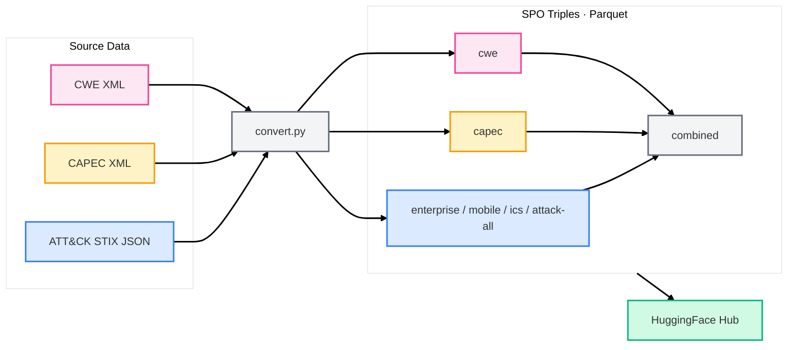
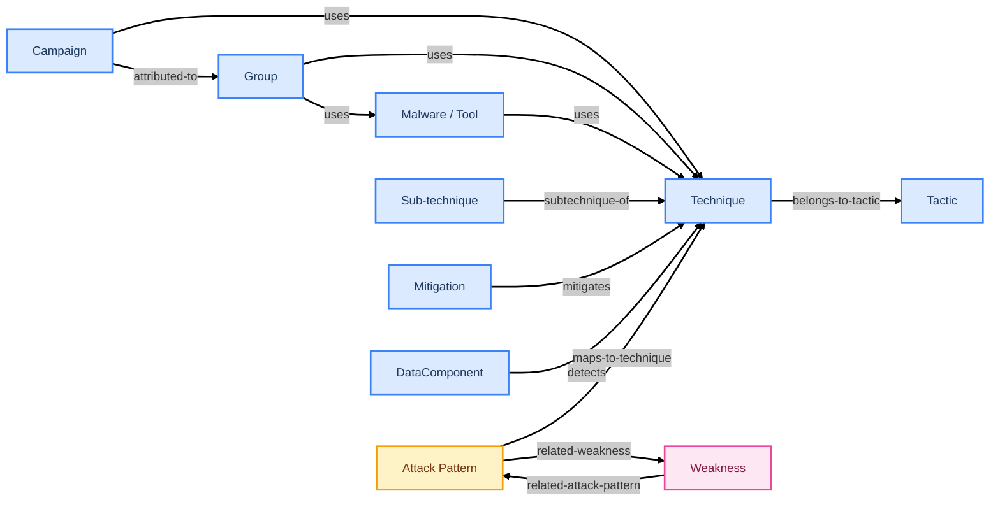

# mitre-attack-kg

[](https://github.com/S0UGATA/mitre-attack-kg/actions/workflows/ci.yml)
[](https://github.com/S0UGATA/mitre-attack-kg/actions/workflows/update-dataset.yml)
[](https://huggingface.co/datasets/s0u9ata/mitre-attack-kg)
[](https://www.python.org/downloads/)
[](LICENSE)

Convert [MITRE ATT&CK](https://attack.mitre.org/), [CAPEC](https://capec.mitre.org/), and [CWE](https://cwe.mitre.org/) data into **Subject-Predicate-Object (SPO) knowledge-graph triples** in Parquet format.

## Data Flow



## Knowledge Graph Structure



> Legend: <span style="color:#3b82f6">**Blue** = ATT&CK</span> · <span style="color:#f59e0b">**Amber** = CAPEC</span> · <span style="color:#ec4899">**Pink** = CWE</span> · Attack Patterns and Weaknesses also form parent–child hierarchies via **child-of** edges (not shown).

## Usage

```bash
# Install dependencies
pip install -r requirements.txt

# Convert everything (ATT&CK + CAPEC + CWE) and produce combined.parquet
python convert.py

# Convert only ATT&CK
python convert.py --sources attack

# Convert a single ATT&CK domain
python convert.py --sources attack --domains enterprise

# Convert only CAPEC and CWE (skip ATT&CK)
python convert.py --sources capec cwe

# Cache downloaded source files for repeated runs
python convert.py --cache-dir /tmp

# Run individual converters standalone
python convert_attack.py
python convert_capec.py
python convert_cwe.py

# Use Parquet v1 format for backward compatibility (default is v2)
python convert.py --parquet-format v1
```

Output goes to `output/`:

| File | Source | Triples |
|------|--------|---------|
| `enterprise.parquet` | ATT&CK Enterprise | 42,041 |
| `mobile.parquet` | ATT&CK Mobile | 5,307 |
| `ics.parquet` | ATT&CK ICS | 3,756 |
| `attack-all.parquet` | ATT&CK combined (deduplicated) | 49,622 |
| `capec.parquet` | CAPEC attack patterns | 8,114 |
| `cwe.parquet` | CWE weaknesses | 14,565 |
| `combined.parquet` | All sources merged (deduplicated) | 71,531 |

Downloaded source files are automatically cleaned up after conversion. Use `--cache-dir` to persist them for repeated runs.

## Tests

```bash
# Unit tests (no network access required)
python -m pytest tests/test_convert_attack.py tests/test_convert_capec.py tests/test_convert_cwe.py -v

# Integration tests (downloads real ATT&CK data)
python -m pytest tests/test_integration.py -v

# All tests
python -m pytest tests/ -v
```

## HuggingFace Dataset

The dataset is published at [s0u9ata/mitre-attack-kg](https://huggingface.co/datasets/s0u9ata/mitre-attack-kg) on HuggingFace Hub and auto-updated weekly via GitHub Actions.

See the [dataset card](hf_dataset/README.md) for schema details, example queries, and usage with the `datasets` library.

## License

Apache 2.0
